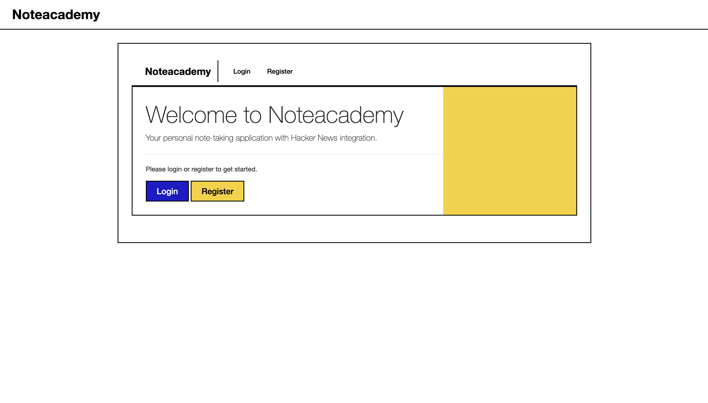
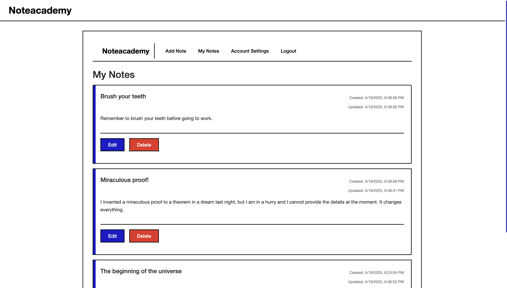
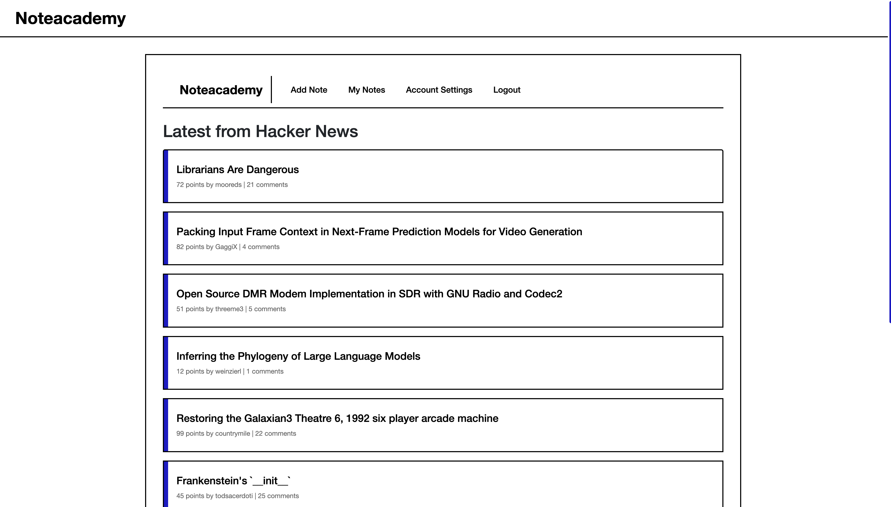

# Noteacademy

[Noteacademy](noteacademy-app.vercel.app) is a note taking app for people who enjoy geometric abstraction.

## Description

> My brain is open. - Paul Erdös

A minimal note-taking app for writing, editing, and deleting notes. Includes basic account management and a built-in Hacker News feed. Simple, clean, and to the point. Are you ready to spill your brain?

## UI

A walkthrough of the app is available [here](https://youtu.be/g1J9z2hRfj8).

## License

MIT license.
